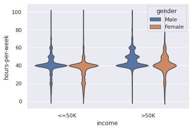
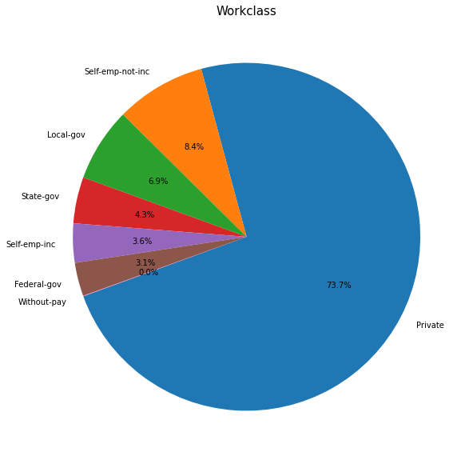

# 
 Adult's Income Prediction 

This data was extracted from the 1994 Census bureau database by Ronny Kohavi and Barry Becker (Data Mining and Visualization, Silicon Graphics). A set of reasonably clean records was extracted using the following conditions: ((AAGE>16) && (AGI>100) && (AFNLWGT>1) && (HRSWK>0)).  
The prediction task is to determine whether a person makes over $50K a year.

# Data Defination
The Adult's Income dataset is collected from kaggle using this <a href = "https://www.kaggle.com/uciml/adult-census-income"> Link </a>  
This dataset has 48842 rows × 15 columns.  

1. age: continuous.
2. workclass: Private, Self-emp-not-inc, Self-emp-inc, Federal-gov, Local-gov, State-gov, Without-pay, Never-worked.
3. fnlwgt: continuous.
4. education: Bachelors, Some-college, 11th, HS-grad, Prof-school, Assoc-acdm, Assoc-voc, 9th, 7th-8th, 12th, Masters, 1st-4th, 10th, Doctorate, 5th-6th, Preschool.
5. education-num: continuous.
6. marital-status: Married-civ-spouse, Divorced, Never-married, Separated, Widowed, Married-spouse-absent, Married-AF-spouse.
7. occupation: Tech-support, Craft-repair, Other-service, Sales, Exec-managerial, Prof-specialty, Handlers-cleaners, Machine-op-inspct, Adm-clerical, Farming-fishing, Transport-moving, Priv-house-serv, Protective-serv, Armed-Forces.
8. relationship: Wife, Own-child, Husband, Not-in-family, Other-relative, Unmarried.
9. race: White, Asian-Pac-Islander, Amer-Indian-Eskimo, Other, Black.
10. sex: Female, Male.
11. capital-gain: continuous.
12. capital-loss: continuous.
13. hours-per-week: continuous.
14. native-country: United-States, Cambodia, England, Puerto-Rico, Canada, Germany, Outlying-US(Guam-USVI-etc), India, Japan, Greece, South, China, Cuba, Iran, Honduras, Philippines, Italy, Poland, Jamaica, Vietnam, Mexico, Portugal, Ireland, France, Dominican-Republic, Laos, Ecuador, Taiwan, Haiti, Columbia, Hungary, Guatemala, Nicaragua, Scotland, Thailand, Yugoslavia, El-Salvador, Trinadad&Tobago, Peru, Hong, Holand-Netherlands.

# Methods
In this project, we have employed the following steps:

1. Data Collection
2. Data Cleaning
3. Data Analysis
4. Data Preprocessing(Preparation)
5. Model Training
6. Performance Evaluation

We have implemented the following models:  

1. SVM
2. Logistic Regression
3. Naive Bayes
4. Desicion Tree
5. Random Forest

# Performance Evaluation
We have calculated the `Precision`, `Recall` , `True positive/negative` for all the models and built a `Confusion Matrix` for the same.

# Results
1. Gender Distribution based on Income

2. Education Count 

3. Work-Class Distribution

4. Age Vs Marital Status

# Conclusion:
* Only a few of the traits are closely associated to income projection, according to the correlation table.  
* The choice of such columns has a big impact on the model's accuracy. Random Forest is also the best fit for this dataset. Males have a higher rate of incorrect predictions than females.  
* The dataset does not have to be perfect or small all of the time. As a result, we must define a method, a method that can be applied to every dataset.  
* Here is a step-by-step explanation of the workflow, which you may apply to your own dataset.  
* Also, different types of visualizations effectively portray data based on a combination of attribute types (numerical, categorical) and a classification technique that is totally reliant on the dataset.
